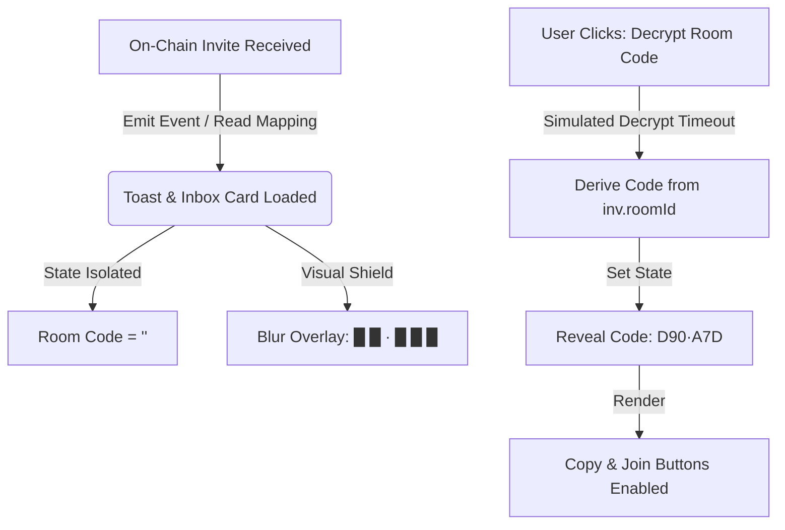

# Concord — Blind Negotiation & Sealed-Bid Auction Protocol

> **Private price discovery powered by Fully Homomorphic Encryption.**
> Built with [Base](https://base.org) & [Fhenix CoFHE](https://fhenix.io).

Concord lets parties discover whether they have a deal — and at what price — without revealing their private numbers. Whether it's a 1-on-1 negotiation or a multi-party sealed-bid auction, every price is encrypted in the browser using the CoFHE SDK before it touches the blockchain. Smart contracts compare encrypted numbers and compute fair midpoints, all while the values remain fully encrypted ciphertext.

---

## Two Modes of Operation

### 1. Blind Negotiation (1-on-1)

Two parties submit encrypted reservation prices. The contract compares them and computes a midpoint — all in encrypted space.

```
Party A: enters floor price → encrypted in browser via CoFHE SDK
                                    ↓
                           on-chain as euint64 (ciphertext)
                                    ↓
Party B: enters ceiling price → encrypted in browser via CoFHE SDK
                                    ↓
                           on-chain as euint64 (ciphertext)
                                    ↓
                    ┌─────────────────────────────┐
                    │   FHE.gte(ceiling, floor)    │  ← Is there a deal?
                    │   FHE.add(floor, ceiling)    │  ← Sum
                    │   FHE.div(sum, 2)            │  ← Midpoint
                    │   FHE.select(match, mid, 0)  │  ← Conditional
                    └─────────────────────────────┘
                                    ↓
                    Result: Deal found at $87.5M
                    (neither $80M floor nor $95M ceiling was revealed)
```

### 2. Sealed-Bid Auction (Multi-Party) — Wave 5

A seller sets an encrypted floor price. Multiple bidders (1-10) submit encrypted ceilings. The contract runs an **FHE tournament bracket** to find the highest qualifying bid.

```
Seller: encrypts floor price → euint64 on-chain
                                    ↓
Bidder 1: encrypts ceiling → euint64 on-chain
Bidder 2: encrypts ceiling → euint64 on-chain
Bidder 3: encrypts ceiling → euint64 on-chain
    ...N bidders...
                                    ↓
            ┌──────────────────────────────────────────┐
            │   for each bid:                          │
            │     isEligible = FHE.gte(bid, floor)     │
            │     isBetter   = FHE.gte(bid, bestBid)   │
            │     bestBid    = FHE.select(both, bid,   │
            │                             bestBid)     │
            │   agreedPrice  = FHE.div(                │
            │                   FHE.add(floor, best),  │
            │                   2)                     │
            └──────────────────────────────────────────┘
                                    ↓
            Result: Winner found at $92.5M
            (no bidder's number or rank was ever revealed)
```

---

## FHE Deep Dive — What Fhenix CoFHE Actually Does

### Client-Side Encryption (Browser)

When a user types "$80M" and clicks submit, the CoFHE SDK runs 5 steps in their browser:

| Step | Operation | Duration | Description |
|------|-----------|----------|-------------|
| 1 | **InitTfhe** | ~2-4s | Downloads TFHE WebAssembly engine (cached after first use) |
| 2 | **FetchKeys** | ~1-2s | Fetches FHE public key from the CoFHE network |
| 3 | **Pack** | <1ms | Packs plaintext into TFHE ciphertext format |
| 4 | **Prove** | ~10-15s | Generates ZK proof that encryption is valid (CPU intensive) |
| 5 | **Verify** | ~1-2s | CoFHE verifier network validates the proof |

After this, the plaintext number **no longer exists**. Only an encrypted blob goes on-chain.

### On-Chain FHE Computation

The smart contract performs arithmetic on encrypted values — without ever decrypting them:

```solidity
// 1-on-1 Negotiation (BlindNegotiation.sol)
ebool hasMatch = FHE.gte(room.partyBPrice, room.partyAPrice);
euint64 encSum = FHE.add(room.partyAPrice, room.partyBPrice);
euint64 encMidpoint = FHE.div(encSum, FHE.asEuint64(2));
euint64 encAgreed = FHE.select(hasMatch, encMidpoint, FHE.asEuint64(0));

// Multi-Party Auction (MultiPartyAuction.sol)
// Pairwise tournament — for each bid:
ebool isEligible = FHE.gte(bid, sellerFloor);
ebool isBetter = FHE.gte(bid, currentBest);
ebool shouldReplace = FHE.and(isEligible, isBetter);
currentBest = FHE.select(shouldReplace, bid, currentBest);
// Final midpoint:
euint64 agreedPrice = FHE.div(FHE.add(floor, bestBid), 2);
```

### What's Visible on the Blockchain

| Data | Visible? | Format |
|------|----------|--------|
| Party addresses | ✅ Public | `0x720392Bb...` |
| Floor / ceiling prices | ❌ **Never** | Stored as `euint64` ciphertext |
| Individual bid amounts | ❌ **Never** | Stored as `euint64` ciphertext |
| Match / winner result | ❌ Encrypted | Stored as `ebool` ciphertext |
| Agreed price | ❌ Encrypted | Stored as `euint64` ciphertext |
| Room / auction status | ✅ Public | Plain enum |

### FHE Operations Used

| Operation | Solidity Call | Purpose |
|-----------|---------------|---------|
| Convert input | `FHE.asEuint64(input)` | Validates ZK proof & stores encrypted value |
| Compare | `FHE.gte(a, b)` | Greater-than-or-equal → encrypted bool |
| Add | `FHE.add(a, b)` | Addition → encrypted sum |
| Divide | `FHE.div(a, b)` | Division → encrypted quotient |
| Conditional | `FHE.select(cond, a, b)` | If-else → encrypted result |
| Logical AND | `FHE.and(a, b)` | Boolean AND → encrypted bool |
| Access control | `FHE.allow(ct, addr)` | Grant decryption permission |

---

## Smart Contracts

### BlindNegotiation.sol (1-on-1)

**Network:** Base Sepolia  
**Address:** `0x46BC52321a0B3C886Fccc2db88142727E44D3B7D`

```solidity
contract BlindNegotiation {
    enum RoomStatus { Open, PendingB, Computing, Settled, Expired }

    struct Room {
        address partyAAddress;     // Plaintext address
        address partyBAddress;     // Plaintext address
        euint64 partyAPrice;       // Encrypted floor (never decrypted)
        euint64 partyBPrice;       // Encrypted ceiling (never decrypted)
        ebool   matched;           // FHE comparison result
        euint64 agreedPrice;       // FHE midpoint if matched
        RoomStatus status;
        uint256 createdAt;
        uint256 deadline;
        uint8 negotiationType;
    }

    function createRoom(bytes32 roomId, InEuint64 calldata encFloor,
                        uint8 nType, uint256 deadline) external;
    function sendInvite(bytes32 roomId, address recipient) external;
    function joinAndCompute(bytes32 roomId,
                            InEuint64 calldata encCeiling) external;
    function publishResult(bytes32 roomId, bool _matched,
                           uint64 _agreedPrice) external;
}
```

### MultiPartyAuction.sol (Sealed-Bid) — Wave 5

**Network:** Base Sepolia  
**Address:** `0xE21E40C8c96e22f019De2d982428a0D782cb6136`

```solidity
contract MultiPartyAuction {
    enum AuctionStatus { Open, Bidding, Computing, Settled, Expired }

    struct Auction {
        address seller;
        euint64 sellerFloor;       // Encrypted floor price
        AuctionStatus status;
        uint256 deadline;
        uint8 maxBidders;
        uint8 negotiationType;
        // Bids stored as array of encrypted euint64 values
    }

    function createAuction(bytes32 auctionId, InEuint64 calldata encFloor,
                           uint8 nType, uint256 deadline, uint8 maxBidders) external;
    function submitBid(bytes32 auctionId, InEuint64 calldata encCeiling) external;
    function computeAuction(bytes32 auctionId) external;     // FHE tournament
    function publishResult(bytes32 auctionId, bool matched,
                           uint256 agreedPrice, address winner) external;
    function sendInvite(bytes32 auctionId, address recipient) external;
}
```

### Contract Functions

| Function | Contract | Called By | What It Does |
|----------|----------|-----------|--------------|
| `createRoom` | BlindNegotiation | Initiator | Stores encrypted floor price, creates room |
| `joinAndCompute` | BlindNegotiation | Counterparty | Stores encrypted ceiling, runs FHE circuit |
| `createAuction` | MultiPartyAuction | Seller | Stores encrypted floor, sets bidder cap & deadline |
| `submitBid` | MultiPartyAuction | Bidder | Encrypts and stores sealed ceiling bid |
| `computeAuction` | MultiPartyAuction | Anyone | Runs FHE tournament bracket to find winner |
| `sendInvite` | Both | Room/Auction creator | On-chain invite to counterparty wallet |
| `publishResult` | Both | Either party | Publishes decrypted result on-chain |

---

## Industry-Specific Dashboards

Each negotiation or auction can be tagged with industry metadata. The encrypted core is identical — only the surrounding context changes.

| Type | Dashboard Fields | Result Label |
|------|-----------------|--------------|
| **M&A Deal** | Company Name, ARR, Employee Count, Funding Stage | Acquisition Price |
| **Salary** | Role Title, Department, Location, Work Model | Agreed Compensation |
| **Real Estate** | Property Address, Sq Ft, Bed/Bath, Year Built | Agreed Purchase Price |
| **Custom** | (none — flexible) | Agreed Price |

---

## Architecture

### Participants

**1-on-1 Negotiation:**
- **Initiator (Party A):** Sets a minimum acceptable price (floor).
- **Counterparty (Party B):** Sets a maximum willingness to pay (ceiling).

**Multi-Party Auction:**
- **Seller:** Sets an encrypted floor price and max bidder count.
- **Bidders (1-10):** Each submits an encrypted ceiling price.

### The Math

**1-on-1:** A deal happens if `Ceiling >= Floor`. Agreed price = `(Floor + Ceiling) / 2`.

**Auction:** The FHE tournament finds the highest bid where `Bid >= Floor`. Agreed price = `(Floor + BestBid) / 2`.

### Privacy Guarantee

Neither party learns the other's reservation price under any outcome:

- **No deal / no qualifying bid:** Each party learns only that no overlap exists.
- **Deal / winner found:** Parties learn the agreed midpoint. Individual prices remain encrypted forever.

This property is enforced cryptographically — not by policy or trust.

---

## Tech Stack

### Blockchain & Cryptography

| Technology | Role |
|---|---|
| Fhenix CoFHE | Native FHE operations on Base Sepolia |
| Solidity ^0.8.26 | Smart contract language |
| `@cofhe/sdk` v0.5.2 | Client-side FHE encryption |
| `euint64` / `ebool` | Encrypted integer and boolean types |

### Frontend

| Technology | Role |
|---|---|
| React 18 + TypeScript | UI framework |
| Vite | Build tool with HMR |
| Framer Motion | Animations |
| Tailwind CSS 4 | Styling |
| wagmi / viem | Contract interaction |
| ConnectKit | Wallet connection |

### Infrastructure

| Technology | Role |
|---|---|
| pnpm workspaces | Monorepo management |
| Foundry | Contract compilation and deployment |
| LocalStorage | Room / auction state persistence + on-chain state |

---

## Application Routes

| Route | Description |
|---|---|
| `/` | Landing page — protocol overview |
| `/role` | Role selection — Negotiation, Join Room, or Sealed-Bid Auction |
| `/create` | 1-on-1: Set floor price, encrypt, create room |
| `/join` | 1-on-1: Enter room code |
| `/room/:id` | 1-on-1: Negotiation room — price submission and FHE computation |
| `/result/:id` | 1-on-1: Deal outcome and agreement details |
| `/auction/create` | Multi-party: Create sealed-bid auction, set floor, invite bidders |
| `/auction/:id` | Multi-party: Live bidding room with countdown and bid progress |
| `/auction/result/:id` | Multi-party: Winner reveal, decrypt & publish |
| `/inbox` | On-chain inbox — received and sent invites |
| `/negotiate` | Interactive demo — protocol demonstration |
| `/profile` | User profile and negotiation history |

---

## Deployed Contracts (Base Sepolia)

| `BlindNegotiation` | [`0x46BC52321a0B3C886Fccc2db88142727E44D3B7D`](https://sepolia.basescan.org/address/0x46BC52321a0B3C886Fccc2db88142727E44D3B7D) |
| `MultiPartyAuction` | [`0xE21E40C8c96e22f019De2d982428a0D782cb6136`](https://sepolia.basescan.org/address/0xE21E40C8c96e22f019De2d982428a0D782cb6136) |
| `USDC` (Base Sepolia) | `0x036CbD53842c5426634e7929541eC2318f3dCF7e` |

---

## Local Development

```bash
# Install dependencies
pnpm install

# Start the frontend
pnpm --filter @workspace/concord run dev

# Build for production
pnpm --filter @workspace/concord run build

# Compile contracts (requires Foundry)
cd contracts && forge build
```

The application runs at `http://localhost:5173`.

### Requirements

- Node.js 18+
- pnpm
- Foundry (for contract compilation/deployment)

---

## Wave 5: Multi-Party Sealed-Bid Auctions & Industry Dashboards

Wave 5 expands Concord from a 1-on-1 negotiation platform into a multi-party encrypted bidding engine.

### What Was Added

1. **MultiPartyAuction.sol** — New contract supporting 1-10 bidders per auction with FHE tournament bracket logic, tracking and decrypting the winning bidder index in ciphertext.
2. **3 New Pages** — CreateAuction, AuctionRoom, AuctionResult
3. **Industry Dashboards** — M&A, Salary, Real Estate, Custom deal types with specialized metadata fields
4. **Updated Navigation** — Sealed-Bid Auction option on role selection, Auctions link in navbar

### FHE Tournament Bracket

The `computeAuction()` function iterates through all bids and performs pairwise FHE comparisons:

```
For each bid:
  1. isEligible = FHE.gte(bid, floor)          // Does this bid meet the floor?
  2. isBetter = FHE.gte(bid, currentBest)      // Is this bid higher than the current best?
  3. shouldReplace = FHE.and(eligible, better)  // Both conditions must be true
  4. currentBest = FHE.select(replace, bid, currentBest)

Final: agreedPrice = FHE.div(FHE.add(floor, bestBid), 2)
```

All operations run on encrypted ciphertext. No bid value, rank, or eligibility status is ever revealed during computation.

---

## Privacy Architecture & Room Code Secrecy

Concord is designed with a strict zero-knowledge trust model where even the platform providers cannot track room activities, participants, or transaction coordinates.

### Room Code Secrecy Architecture

A Room Code (e.g., `D90·A7D`) is a human-friendly representation of the underlying 32-byte cryptographic `roomId` or `auctionId` (which serves as the smart contract mapping key). 

To ensure complete secrecy and prevent side-channel surveillance or passive blockchain analysis, room codes use the following privacy architecture:

1. **State-Level Isolation (Zero-Knowledge Memory)**
   - The frontend application isolates the plaintext Room Code state. It is **never** pre-computed or loaded into the component's state or React render scope upon loading the inbox.
   - The Room Code state is initialized as an empty string `""` and is hidden behind a secure blur overlay (`██·███`).
   
2. **On-Demand Client-Side Decryption**
   - The room code is only derived (`roomIdToCode(inv.roomId)`) when the recipient (or sender) explicitly triggers the `Decrypt Room Code` action. This requires user intent and active local wallet context.

3. **No Notification Leaks**
   - Toast notification objects in the notification manager (`ToastManager.tsx`) do not store the room code in memory for received invites. Subtitles in the toasts for both senders and receivers display generic helpers (*"Decrypt the invite in your inbox to reveal the room code"*), completely removing pre-decryption visual leakage.

4. **Symmetric Creator Shielding**
   - To prevent passive shoulder-surfing or recording leaks during live demos, the same encryption/decryption shield is applied to the creator's *Sent* folder. The creator must also explicitly decrypt their sent invites to view or copy the room codes.

### Flowchart: Room Code Cryptographic Decryption



---

## Security Properties

- **Input Privacy:** Prices encrypted on-device before any network transmission
- **Computation Integrity:** All arithmetic runs inside Fhenix CoFHE — no trusted intermediary
- **Zero-Knowledge No-Deal:** When no overlap exists, neither party learns any bound
- **Partial Revelation on Deal:** Only the midpoint is revealed; individual prices remain encrypted
- **Auction Secrecy:** No bidder learns any other bidder's price, rank, or eligibility
- **Room Code Confidentiality:** Room codes are shielded symmetrically from senders, recipients, and observers until decrypted in-app.

## License

MIT

*Built with Base & Fhenix CoFHE. Fully homomorphic encryption for private price discovery.*
